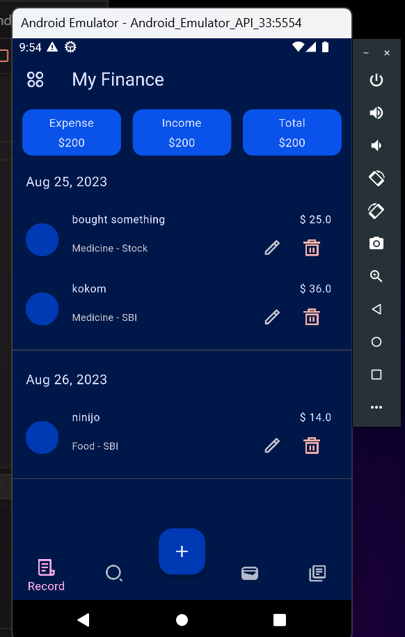
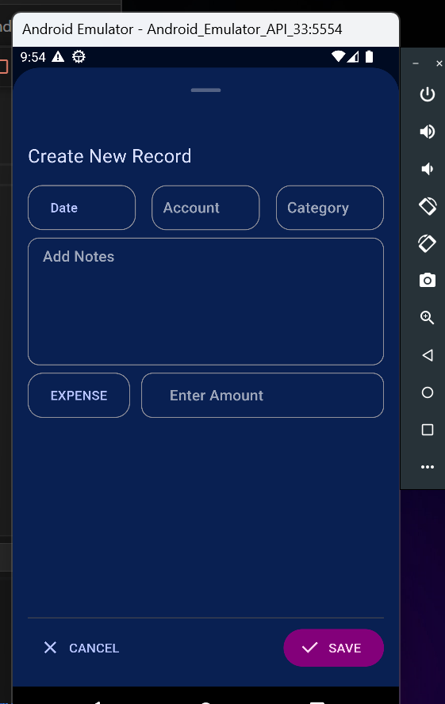
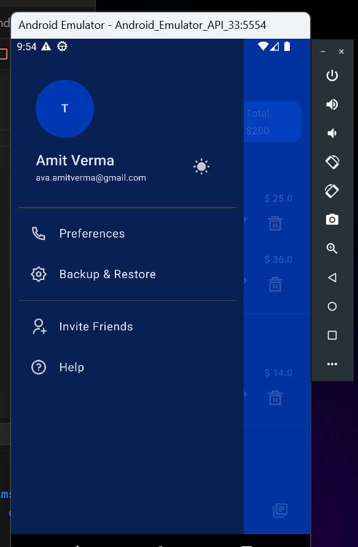
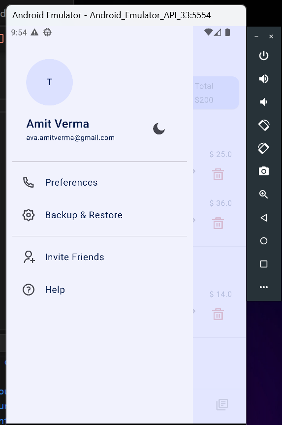
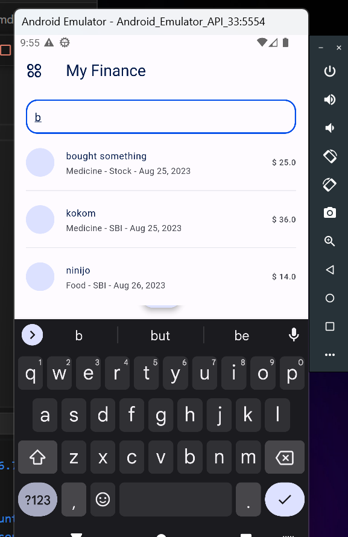
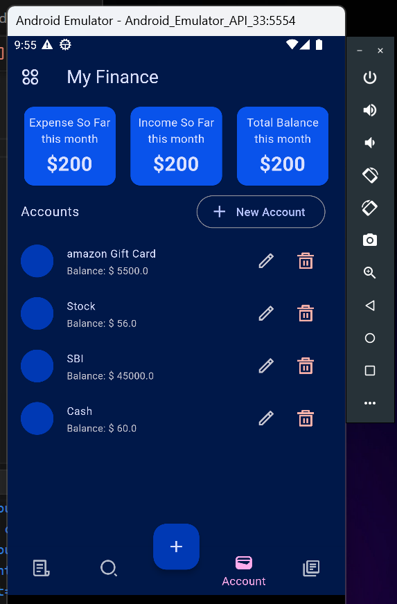
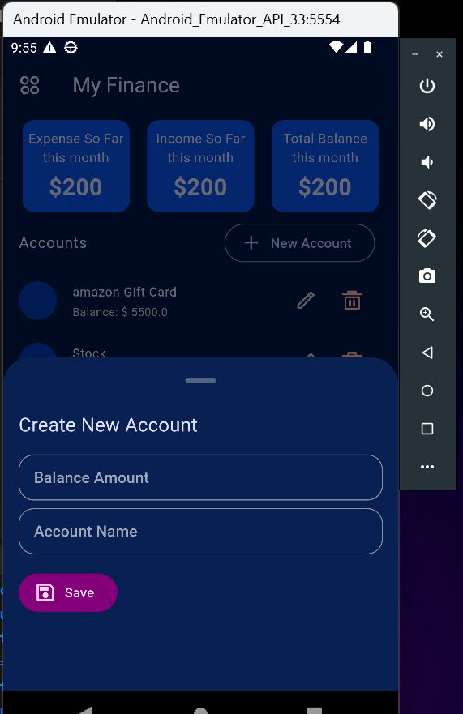
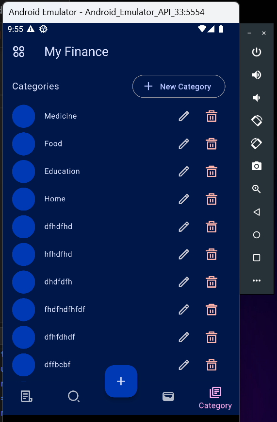

# myfinance

A Budget Tracker App [In-Progress]

## Results

## Screenshots

   

   

   

   

## Support

  
[Instagram](https://www.instagram.com/amve.me)  
[LinkedIn](https://www.linkedin.com/in/amit-verma-211285288/)

> If you found this project helpful or you learned something from the source code and want to thank me, consider buying me a cup of :coffee:
>
> * UPI ID - av.amit2040fw@okaxis
